# Proyecto de automatización de pruebas

Proyecto Java desarrollado para implementar pruebas automatizadas,
integración continua, generación de reportes y gestión de versiones.

## Autor

David Sandoval

## Objetivo

Profesionalizar el proceso de pruebas de una aplicación Java mediante
pruebas unitarias, cobertura de código, reportes HTML navegables y un
pipeline de integración continua.

## Funcionalidades

La aplicación permite gestionar el registro de compras y contempla:

- Cálculo del total de una compra.
- Actualización del stock disponible.
- Validación de cantidades inválidas.
- Validación de stock insuficiente.
- Validación de productos inexistentes.
- Compra de todo el stock disponible.

## Tecnologías utilizadas

- Java 17.
- Maven.
- Spring Boot.
- JUnit 5.
- Maven Surefire.
- Maven Surefire Report Plugin.
- JaCoCo.
- Git y GitHub.
- GitHub Actions.
- Cucumber.
- Gherkin.
- Apache JMeter.

## Requisitos previos

Antes de ejecutar el proyecto es necesario disponer de:

- Java 17 o superior.
- Maven 3.9 o superior.
- Git.
- Un navegador web para visualizar los reportes HTML.

Para comprobar las instalaciones:

```bash
java -version
mvn -version
git --version
```

## Conclusiones

La automatización implementada permite detectar errores de forma temprana
y mantener resultados repetibles durante el desarrollo. La combinación de
JUnit, Maven, JaCoCo y GitHub Actions permite compilar, probar y medir la
cobertura automáticamente.

Además, el uso de ramas, pull requests y reglas de protección mejora la
trazabilidad de los cambios y evita integrar código que no haya superado
las pruebas automatizadas.

## Evidencias

### Ejecución local de las pruebas

Las pruebas se ejecutaron localmente mediante Maven. El resultado fue de
ocho pruebas aprobadas, sin fallos ni errores.

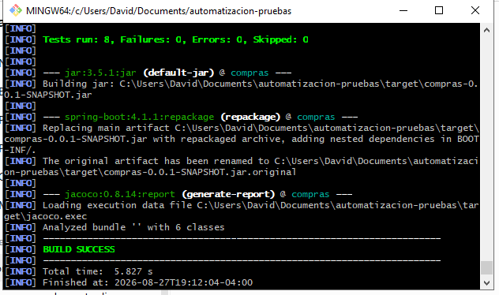

### Cobertura de código local

JaCoCo generó un reporte navegable con una cobertura total del 88 % y una
cobertura del 100 % para el servicio de compras.

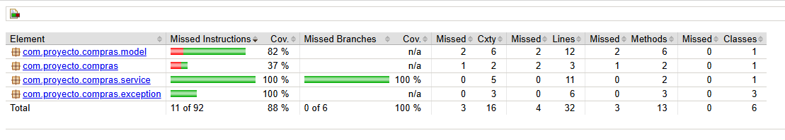

### Ejecución de las pruebas en integración continua

GitHub Actions ejecutó automáticamente la compilación, las pruebas y la
generación de los reportes sobre la rama `develop`.

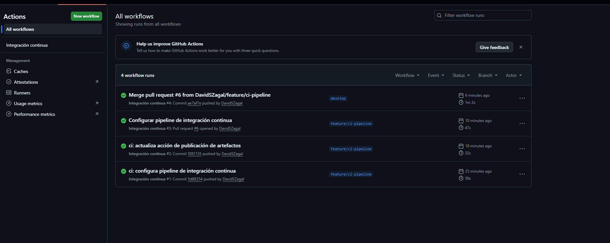

### Reportes publicados como artefactos

El pipeline publicó los resultados de Surefire y el reporte de cobertura
JaCoCo como artefactos descargables.

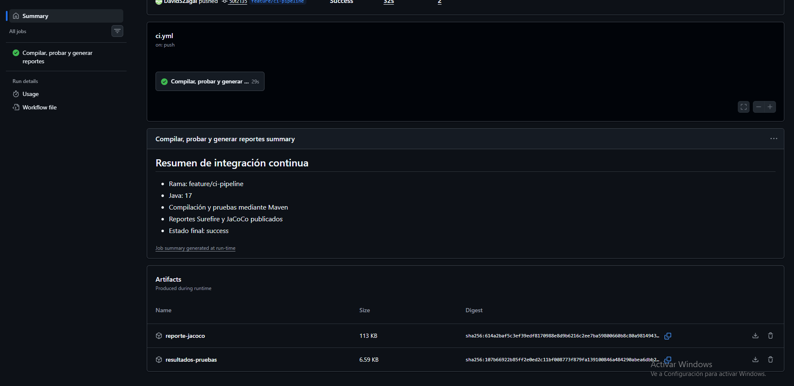

## Flujo completo de automatización — Actividad 2

Durante la Actividad 2 se amplió el proyecto incorporando BDD con Cucumber, pruebas básicas de rendimiento con Apache JMeter y una propuesta de alertas automáticas.

El flujo implementado fue el siguiente:

1. Se realizó una sesión Three Amigos para definir la historia de usuario, las reglas de negocio, los ejemplos y los criterios de aceptación.
2. Los criterios acordados se transformaron en escenarios Gherkin, incluyendo un Scenario Outline para validar diferentes cantidades y niveles de stock.
3. Los escenarios fueron automatizados mediante Cucumber, Java y JUnit utilizando un runner y Step Definitions.
4. Las pruebas BDD se integraron en GitHub Actions para ejecutarse automáticamente durante la integración continua.
5. El pipeline genera un reporte HTML navegable de Cucumber y lo publica como artefacto descargable.
6. Se implementó una prueba básica de rendimiento con Apache JMeter para simular 200 solicitudes al servicio de compras.
7. Se analizaron las métricas principales del dashboard de JMeter, incluyendo tiempo de respuesta, percentiles, throughput, APDEX y porcentaje de errores.
8. Se documentó una propuesta de alertas automáticas basada en umbrales de rendimiento y canales de notificación.

La verificación final del proyecto ejecutó 14 pruebas automatizadas sin fallos ni errores.

## Evidencias de la Actividad 2

### Sesión Three Amigos

Se documentaron la historia de usuario, los participantes, las reglas de negocio, los ejemplos y los criterios de aceptación.

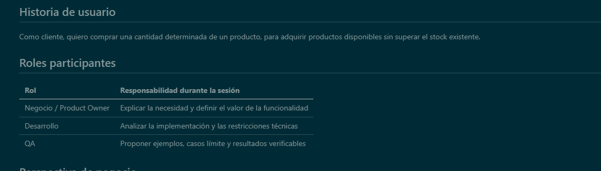

### Escenarios Gherkin

Los criterios de aceptación se transformaron en escenarios Gherkin y en un Scenario Outline con diferentes ejemplos.

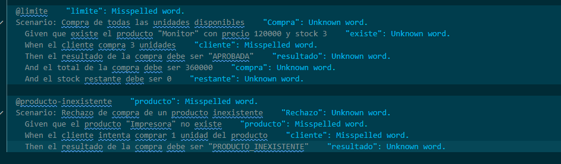

### Step Definitions con Java y Cucumber

Los pasos Given, When y Then fueron implementados en Java para automatizar los escenarios del registro de compras.

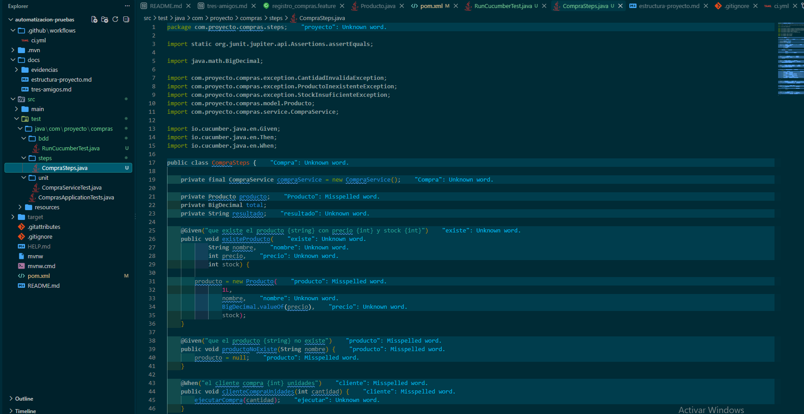

### Integración BDD en GitHub Actions

El pipeline ejecuta las pruebas unitarias y los escenarios BDD, valida sus resultados y publica los artefactos correspondientes.

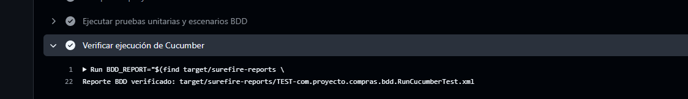

### Reporte HTML de Cucumber

Cucumber genera un reporte HTML navegable con los escenarios, ejemplos, pasos y resultados de la ejecución.

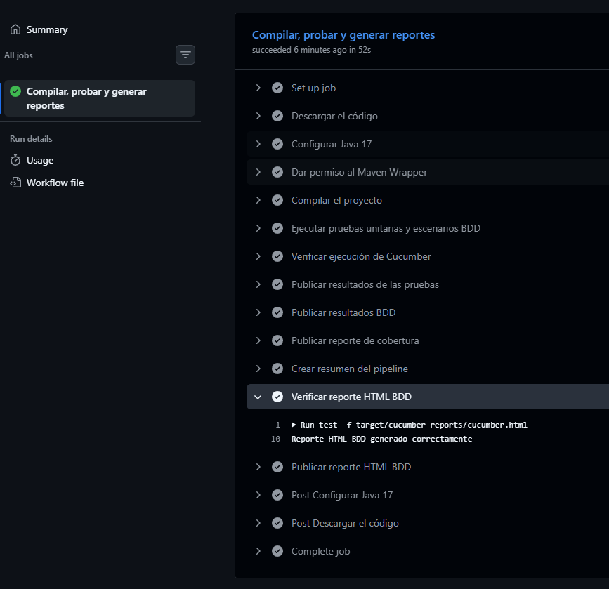

### Dashboard de Apache JMeter

La prueba de rendimiento ejecutó 200 solicitudes y permitió revisar los tiempos de respuesta, errores, throughput y APDEX.

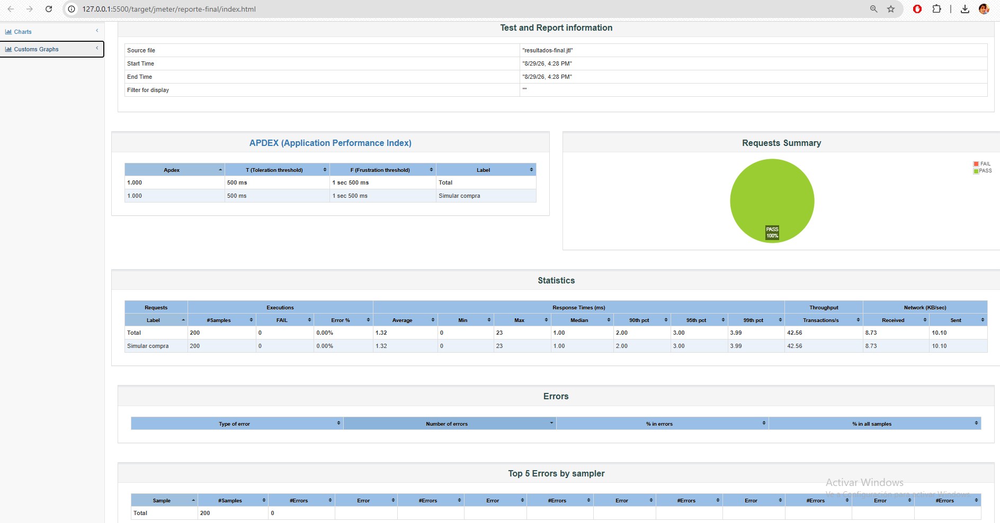

### Interpretación de métricas

Las métricas y gráficos de JMeter fueron analizados para explicar el comportamiento observado durante la prueba.

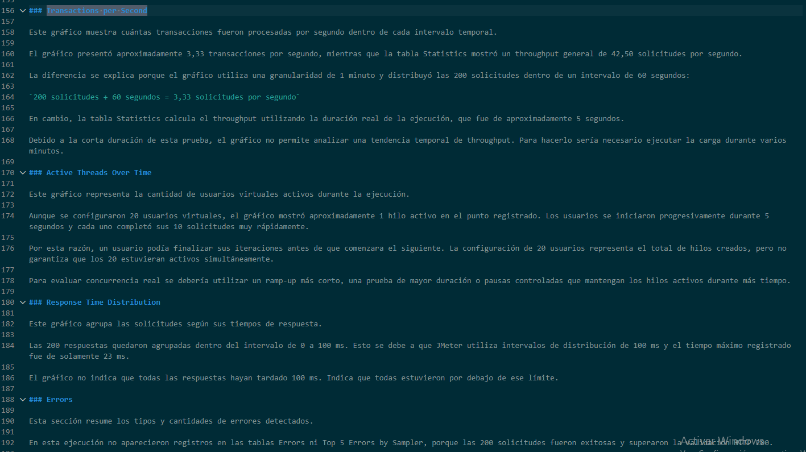

### Alertas automáticas de rendimiento

Se definieron estados correctos, advertencias y alertas críticas para detectar posibles degradaciones del servicio.

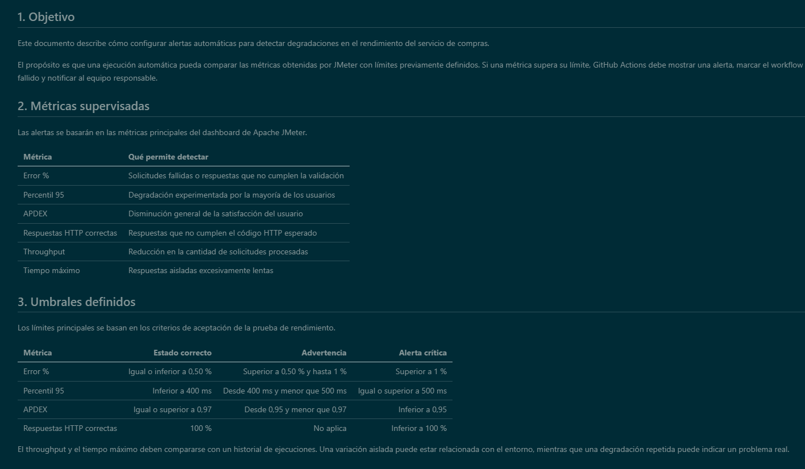
### Pull request y cierre de la actividad

La documentación final fue validada mediante un pull request con todos los controles de integración continua aprobados.

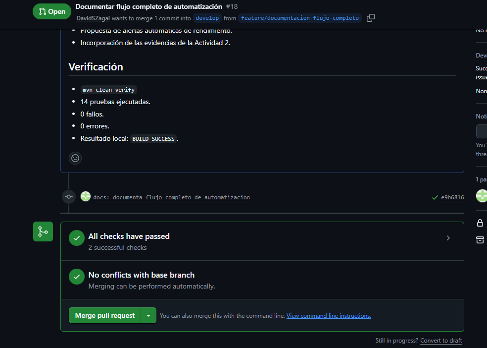

El pull request fue integrado correctamente en la rama `develop`.

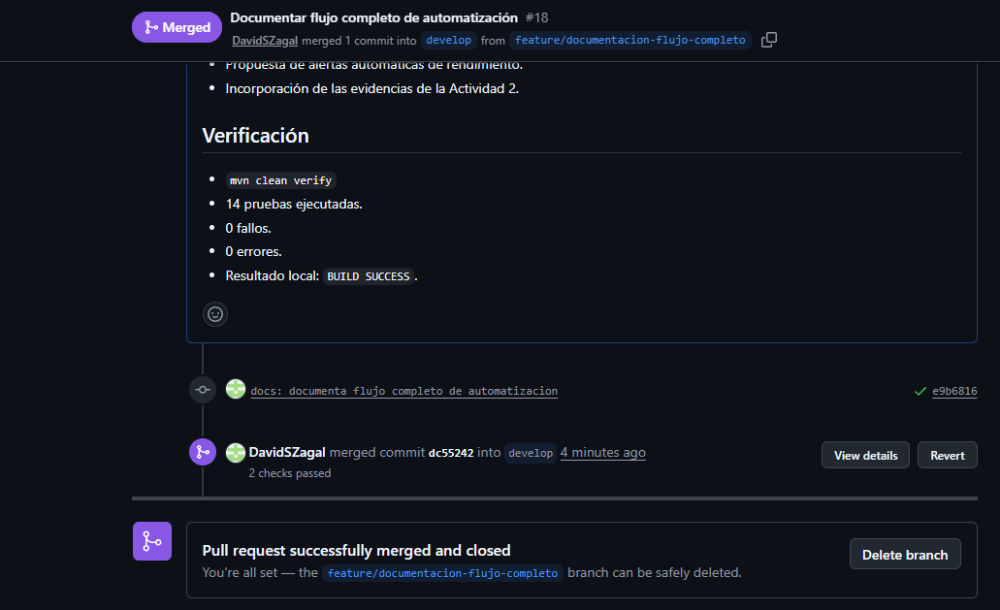